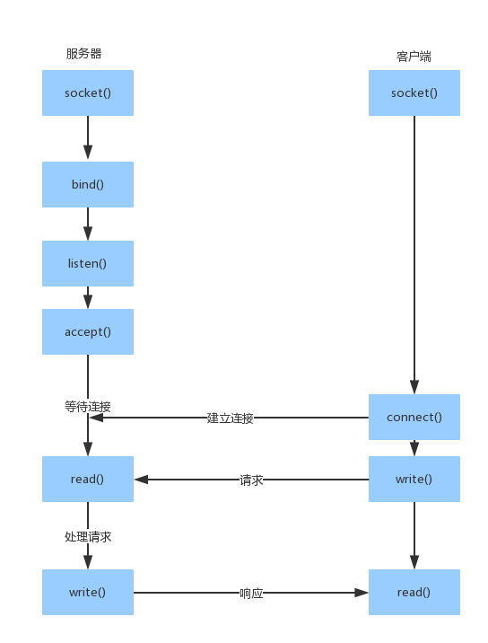
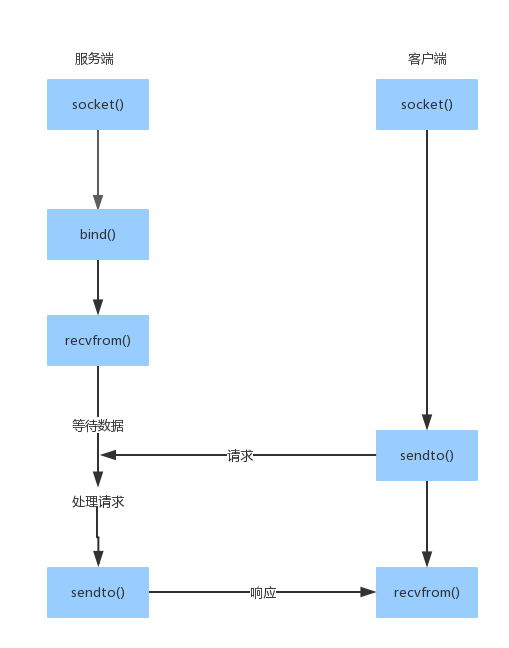

# 服务器端socket建立

## C/S模式
Client/Server模式，服务器一般在系统启动的时候自动调用运行，并等待客户机的请求。  

与其对应的是B/S模式，即Browser/Server模式。  
客户端使用统一的浏览器，而不用专门的部署。服务器端与浏览器之间使用应用层的HTTP协议进行通信。  

 **其实质上就是软件设计中进程间相互作用关系的模型**

## 套接字网络编程基础
TCP通信模型  

  

UDP通信模型  



### python标准库中的socket模块

- socket模块中的socket对象和前面介绍的socket在本质上是不同的，此处的socket对象是支持网络通信的，程序员可以借助它实现网络通信
- socket对象支持使用TCP或者UDP进行网络通信
- 提供了socket编程所需的对象、函数和常量
#### 创建套接字
`socket.socket(family, type)`返回建立的套接字引用
socket参数：
  - 地址：`AF_INET`(IPv4)、`AF_INET6`(IPv6)、`AF_UNIX`(操作系统进程间)
  - 传输层协议：`SOCK_STREAM`(TCP)、`SOCK_DGRAM`(UDP)  
**默认的参数就是IPv4和TCP的协议**

- 服务器端套接字方法  
  - `bind(address)`,address为(IP,PORT)构成的元组。  
  - `listen(backlog)`,开始TCP转入连接。backlog拒绝连接前，允许操作系统挂起的连接数，范围是1~5,一般来说5就足够了。
  - `accept()`,接收TCP连接，并且返回连接上的套接字对象和客户端地址构成的元组。返回的连接上的套接字对象可用于接收和发送消息。

- 客户端套接字方法
  - `connect(address)`,address为(hostname, port)构成的元组。建立与服务器端的连接。

- TCP协议的socket收发数据方法
  - `recv([buffsize])`,接收数据，buffsize指定接收最大数据量，返回接收的数据
  - `send(bytes)`,通过socket发送data
  - `sendall(bytes)`,通过socket发送data(返回前将数据发送完)
- UDP协议的socket收发数据方法
  - `recvfrom([buffsize])`,接收数据，参数同recv()。返回(data, address)元组，address是发来数据主机address
  - `sendto(vytes, address)`，bytes：要发送的字节串。address：为(ipadrr, port)的元组，指定发送的目的

### 用socket套接字建立TCP连接的基本方法
- 创建套接字并绑定地址
- 开始监听连接
- 接收连接并收发数据
- 关闭套接字

服务器端：

```python
import socket
HOST = ''
PORT = 3214
 # 使用默认参数，即IPv4和TCP传输
s = socket.socket()        
s.bind((HOST, PORT))
s.listen(5)               

# 监听客户端连接，返回的就是客户端对象和连接地址
clnt, addr = s.accept()
print("Client Address:", addr)

while True:
  data = clnt.recv(1024)
  if not data:
    break
  # py3中，接收的是二进制字节码，所以需要decode()方法解码
  print("Recieve Data:", data.decode('utf-8'))
  # 将接收自客户端的数据发回客户端
  clnt.send(data)

clnt.close()
s.close()
```

### 用socket建立UDP连接
- 创建套接字连接并绑定地址
- 开始监听连接
- 收发数据
- 关闭套接字

服务端：
```python
import socket
HOST = ''
PORT = 3214

s = socket.socket(socket.AF_INET, socket.SOCK_DGRAM)

s.bind((HOST, PORT))

data = True

while True:
  data, addr = s.recvfrom(1024)
  # b 表示二进制形式的数据
  if data == b'True':
    break
  print('Receive String:', data.decode('utf-8'))
  s.sendto(data, addr)
s.close()
```
