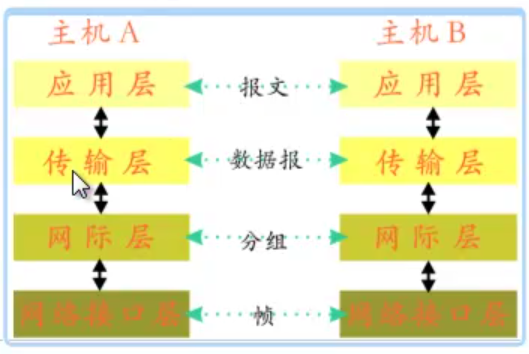

# 网络编程基础

## 网络协议
### TCP/IP协议  

特点：  
  - 独立于计算机系统和硬件，免费使用  
  - 统一分配网络地址
  - 高层协议标准化，提供了可靠的服务
  - 建立一个统一的逻辑网络，隔离了物理网络的硬件差异

协议分层  
  - 应用层  
    FTP/HTTP/DNS/SMTP等
  - 传输层  
    TCP/UDP等
  - 网际层（网络层）  
    IP  
  - 网络接口层  
    - TCP/IP协议没有提供这一层的实现
    - 要求第三方为其上层提供访问接口
    - IEEE802.3(以太网际协议)、IEEE802.4（令牌环网）
    - 具体由操作系统的设备驱动程序和网卡实现

通信基本过程  

主机A和主机B之间的通信过程中，应用层发起请求(request),该层的数据成为报文，报文并不能直接发送，需要在主机A上进行加工，传输层首先将报文加工成为数据报形式，再传给下一层，网际层，网际层拿到数据报以后，进行分组，再传送给网际协议层，再通过硬件设备，如网线、wifi等方式传送给主机B。主机B拿到数据后，层层解包，向上传递，直到最终到达应用层。  

### UDP协议（用户数据报协议）  

特点：  
  - 无连接，减少网络开销和时延
  - 尽最大努力交付，上层对数据作验证处理
  - 无拥塞控制，**用在保证速率的数据传送中（IP电话、网络视频）**

### TCP协议（传送控制协议）
特点：
  - 面向连接的通讯协议（通信前先建立连接，实质为**虚连接**，结束通信后拆除连接）
  - 提供可靠的交付服务
  - 实现了全双工通信
  - 面向字节流（**传输的任何数据被视为二进制代码流**）
  - 一个连接只能有两个传输端点（点对点连接）

综上，在python编程中，实现TCP网络编程的时候，需要了解怎样处理二进制代码流。

### Socket套接字

在实现UDP协议或者TCP协议时，使用的概念就是Socket概念。  

TCP连接的端点称为套接字或者插口。  
- 表示方法：`IP地址:端口号`
- 一个socket就是: (IP地址:端口号)
- 一个TCP连接就是两个套接字，即`{（IP地址:端口号）,（IP地址:端口号）}`
- 每一条TCP连接被两个套接字确定
- 同一IP地址可以有不同的TCP连接(不同端口)，同一端口号可以出现在不同类型的连接中(不同的传输协议)

### TCP和UCP的异同点
不同点：
  - TCP先建立连接，再通信，最后释放连接(时延高)；UDP不用管理连接
  - TCP保证数据可靠交付，用起来省心；UDP不保证可靠交付，用户应自行处理可靠性
  - TCP连接开销大，UDP开销小
  - TCP适用实时性低，但数据可靠性高的场合；UDP适用实时性高，但数据可靠性低的场合

相同点：
  - 都位于TCP/IP协议的第四层(传输层)
  - 为应用层提供服务
  - 都要通过网际层来具体实现数据传输

### 应用举例
TCP：
  - HTTP
  - FTP
  - TELNET
  - POP
  - SMTP
UDP:
  - TFTP
  - DNS
  - SNMP
  - VoIP
  - QQ
